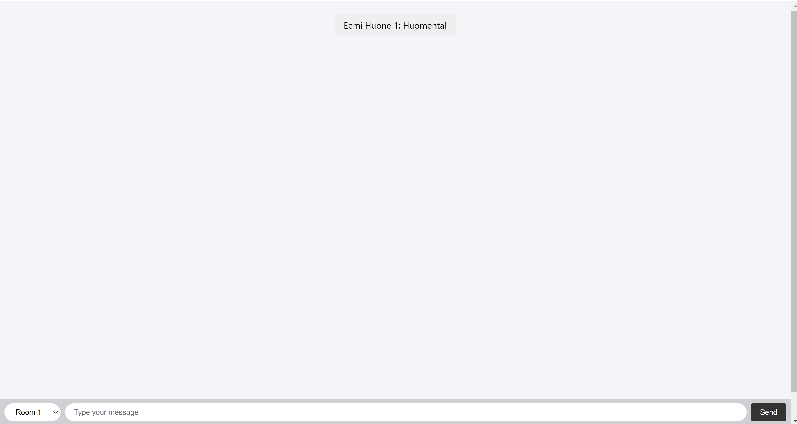

## Assignment - Chat application with Socket.IO

Socket.IO chat application made from modifying this [repository.](https://github.com/RaoofJM/nodejs-socketio-chat-application) Small changes were made which are shown on the screenshots.

## Application

When you open the localhost you first have to choose your nickname

Screenshot of room 1

Screenshot of room 2

Screenshot of room 3

## Explain namespaces in Socket.IO? How they are different from rooms and how could you use those in your app?

Namespaces in Socket.Io is a way to divide seperate channel connections by using specific name for a socket connection. For example /chat , /admin & /notifications . You could use it to handle different functions of your application. 